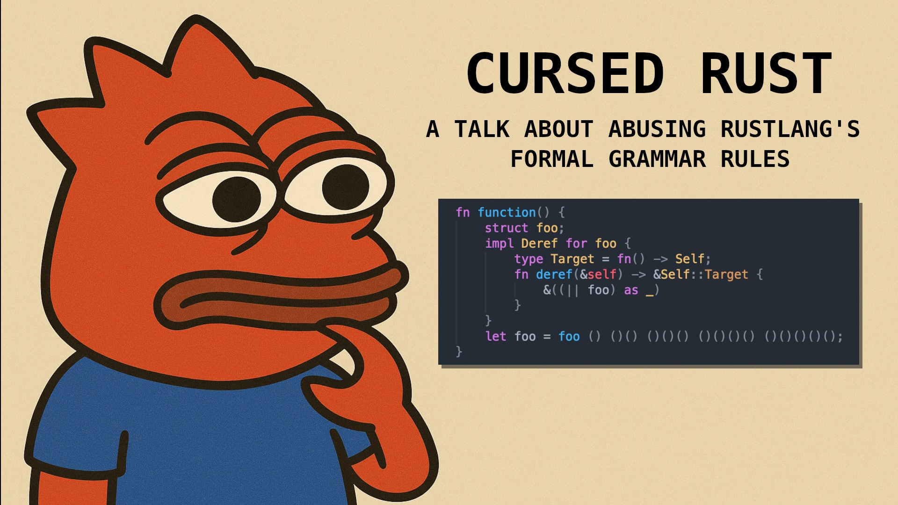

# Cursed Rust Talk
#### ⚠️ DISCLAIMER  
This repository should **not** be taken seriously. It’s riddled with jokes, cursed code and procedural macro abuse.
----

## Overview    
This repo contains example code for my talk: **Cursed Rust**.  

It has two crates:  
- **Main crate** (root `cargo.toml`)  
  - Contains several binaries, each acting as its own “chapter.”  
  - They exist purely to demonstrate Rust’s formal grammar rules and to poke fun at your colleagues.  
  - The final chapter is ~stolen~ borrowed from [`weird-exprs.rs`](https://github.com/rust-lang/rust/blob/master/tests/ui/expr/weird-exprs.rs).  

- **`tokio` crate** (not to be confused with [tokio](https://tokio.rs))  
  - A cursed Rust parody of the [tokio](https://tokio.rs) crate (not to be confused with **`tokio`**).  
  - Exists solely to show how you can gaslight coworkers who rely on LLMs for AI-assisted coding.  
----
## Running the Code  
Even though most of the code is cursed, the binaries *do* compile:  

```bash
cargo run --bin 0[1-7]   # i.e. chapter 1 = --bin 01
```
The only one crate worth “playing” with is `--bin 05` (Chapter 5):
```rust
#[tokio::main]
async fn main() {
    // DON'T REMOVE THIS IT WON'T COMPILE OTHERWISE!!!
    {5;}()
}
```
Yes, that `{5;}()` must stay. Don’t ask why.
Or better: I dare you to remove it.

👉 The explanation lives inside the **`tokio`** crate (not to be confused with [tokio](https://tokio.rs)).


